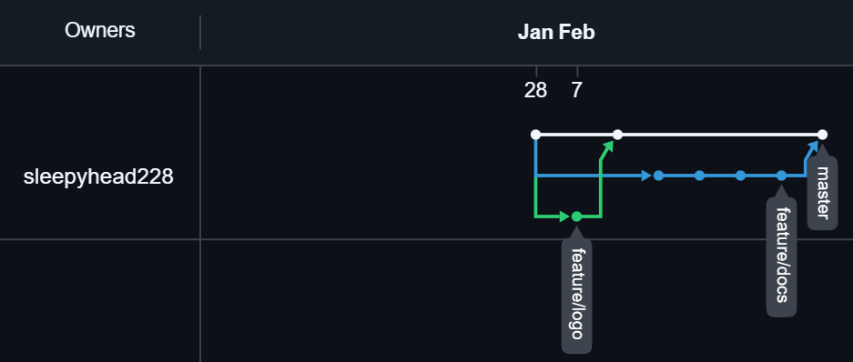

# GitNotify

**GitNotify** — это утилита для получения уведомлений о событиях в Git-репозиториях. Она отслеживает изменения и отправляет оповещения в удобном для вас формате.

Разработчик: sleepyhead228

## Документация

*   [История изменений (Changelog)](changelog.md)
*   [Руководство по установке](install.md)

## Схема ветвления

